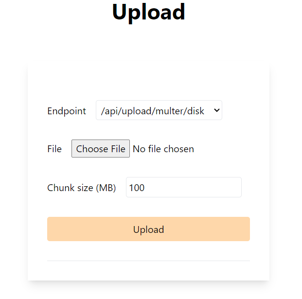
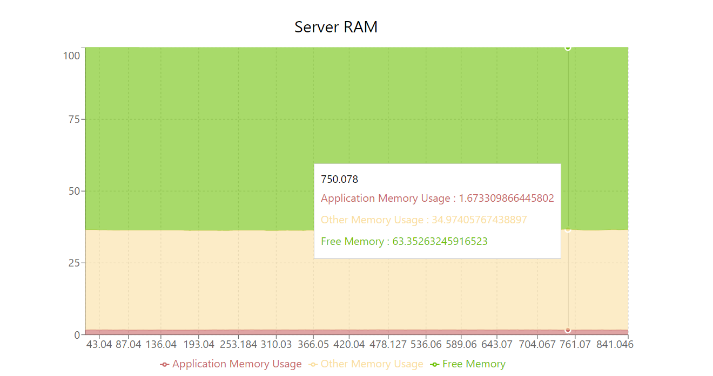
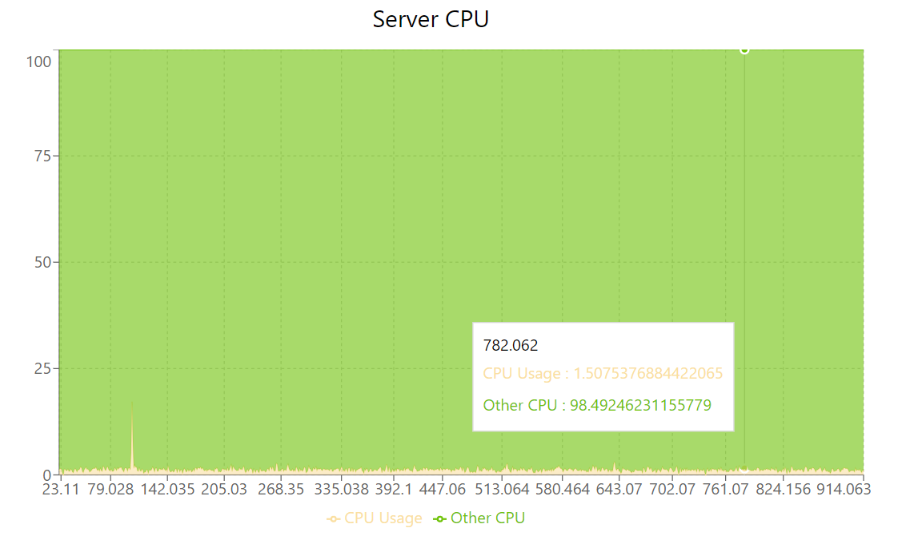
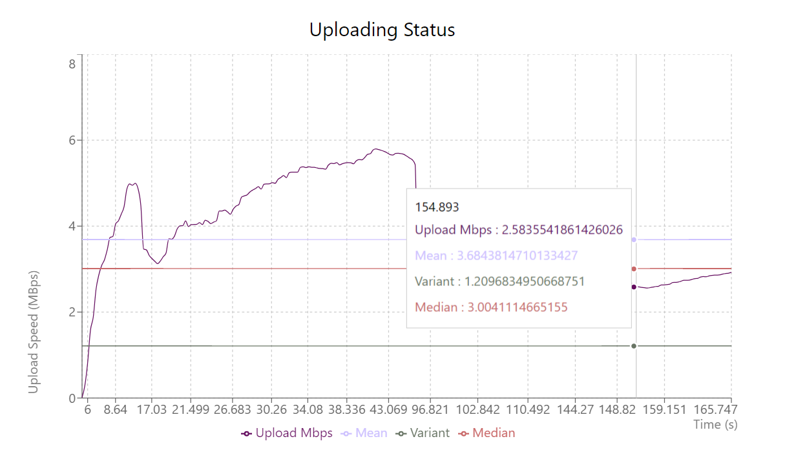
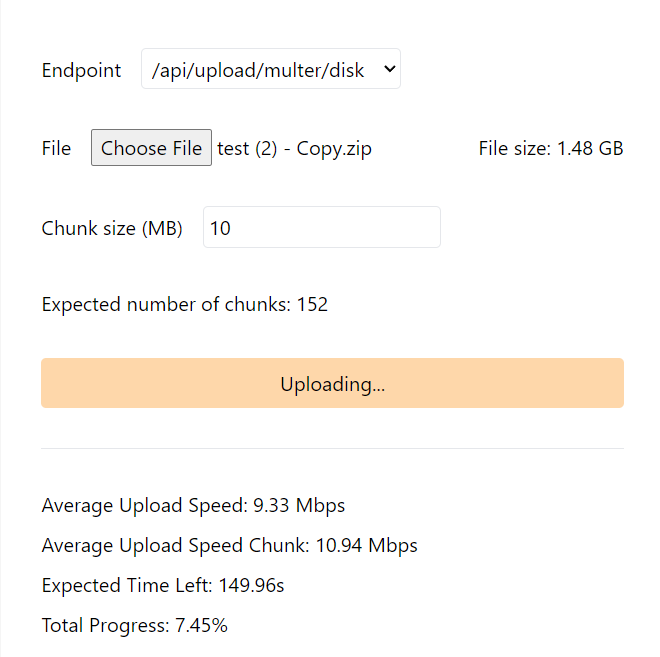
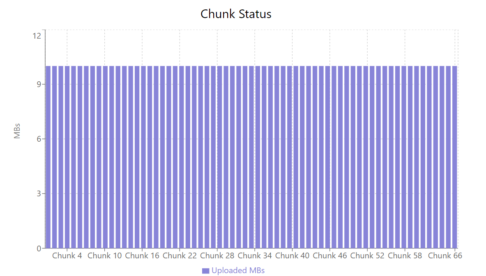
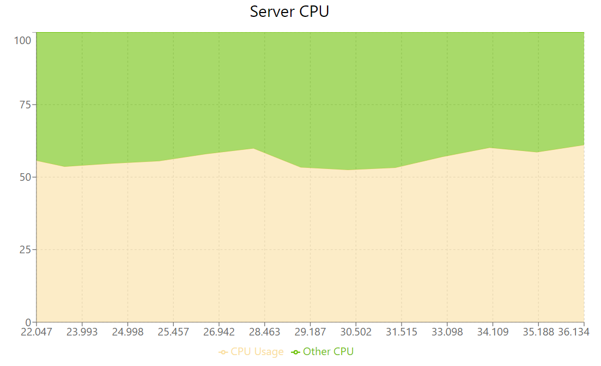
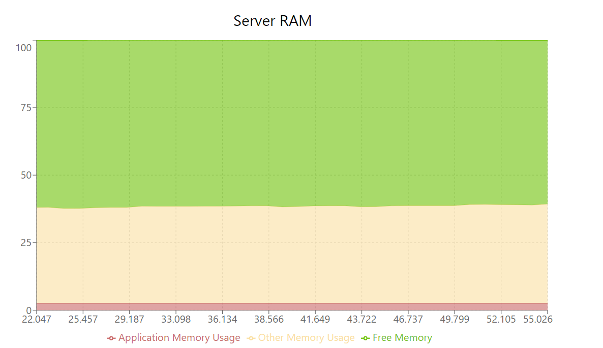
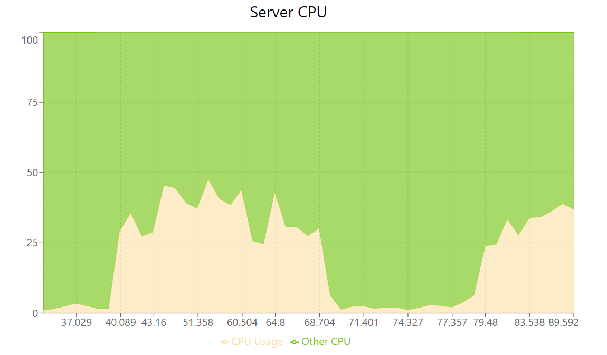
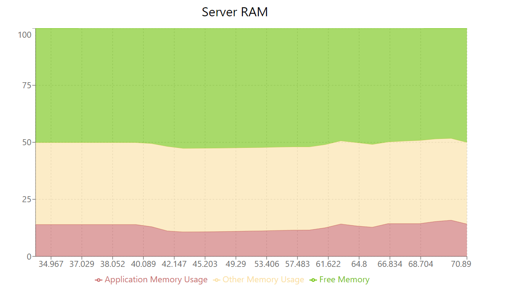

# My Large Upload
## Install & Run
You must have NodeJS (> 20) to run this project.
* npm
```shell
# install dependency
npm install

# start api server
npm run start:api

# start front-end application
npm run start:front
```
* yarn
```shell
# install dependency
yarn

# start api server
yarn start:api

# start front-end application
yarn start:front
```
## How To Use?
After you start the application, go to [http://localhost:3000](http://localhost:3000) to start uploading. You can also host this app to an VPS to simulate the real environment.
### Upload Form
This is the form in which you upload your file:



There are 3 endpoints to test:
* `/api/upload/multer/disk` - upload file parts to `multer`'s `disk storage` endpoint.
* `/api/upload/multer/mem` - upload file parts to `multer`'s `memory storage` endpoint.
* `/api/upload/busboy` - uploading file parts to `busboy` endpoint.

`Chunk size` is the field that indicates the maximum upload file part's size. For example: the chunk size is 100MB and the file is 523MB, the file will be splited into 6 parts: 5 100MB parts and 1 23MB part.
### Server Status
There are 2 diagrams that show the status of the server: `Server RAM` and `Server CPU`:
* Server RAM diagram displays the percentage of memory that the application is using over total memory of the server.



* Server CPU diagram displays the percentage CPU usage of the application over server CPU.


### Uploading Status
This diagram shows the current uploading measurements from client to server. 



The upload form also shows you some more useful information such as avg(upload speed), avg(chunk's upload speed), time left, total progress.


### Chunk Status
This diagram displays the uploading chunks status.


## Implementation Explain
### Client Side
#### Idea
When user wants to upload a file, we call `file.slice()` to get a part from the file. Then we proceed to upload that part to the server.
```typescript
const numberOfChunks = Math.ceil(fize.size / chunkSize);
for (let i = 0; i < numberOfChunks; i++) {
    const start = i*chunkSizeByte;
    const end = Math.min(file.size, start+chunkSizeByte);
    const blob = file.slice(start, end);
    const formData = new FormData();
    formData.set('filename', file.name);
    formData.set('chunk', blob);
    formData.set('chunkIndex', String(i+1));
    await axios.post(uploadEndpoint, formData);
}
```
#### Real-life implementation
1. Step 1: call API server to get an uploading URL/uploading ID
2. Step 2: split and upload the chunks with the provided URL/ID and label the chunk by index/ID.
3. Step 3: call API server to complete the uploading process

**_Note_**: We should provide the mechanism for retrying the failed parts and aborting the uploading.
### Server Side
In this project, the server application provides the client 3 endpoints to upload, 2 of which are using `multer` and the last one is using `busboy`.
#### Busboy
Busboy is the event-based library to handle `multipart/form-data` requests.
```typescript
// busboy.ts
import busboy from 'busboy';
import { NextFunction, Request, Response } from 'express';
import * as fs from 'fs';

const uploadsFolder = 'uploads';

export const handleFile = (req: Request, res: Response, next: NextFunction) => {
  // Initialize
  const bb = busboy({
    headers: req.headers,
  });

  // events
  bb.on('file', (fieldName, file, info) => {
    // using write stream to pipe the file stream to disk
    const writter = fs.createWriteStream(`${uploadsFolder}/${info.filename}`);
    file.pipe(writter);
  });

  bb.on('field', (fieldName, val) => {
    console.log(fieldName, val);
  });
  
  bb.on('error', (err) => {
    console.error(err);
  });

  bb.on('finish', () => {
    next();
  });
  // ------------

  // pipe the request to busboy handler
  req.pipe(bb);
};
```
#### Multer
Multer is a commonly used libary for handling `multipart/form-data` request. There are 2 types of storage:
* Disk Storage: the same methodology as the busboy implementation above, which pipe the file stream into disk.
* Memory Storage: the file is locally stored in the application's memory. We can receive the file's buffer with `req.file?.buffer`.
```typescript
// multer.ts
import multer, { diskStorage, memoryStorage } from 'multer';

const uploadFolder = 'uploads';

const diskStore = diskStorage({
  destination: (req, file, cb) => {
    cb(null, uploadFolder);
  },
  filename: (req, file, cb) => {
    cb(null, file.originalname);
  },
});

const memStore = memoryStorage();

// Disk Storage
export const uploadDisk = multer({ storage: diskStore });

// Memory Storage
export const uploadMem = multer({ storage: memStore });
```
We can easily tell the difference between disk storage and memory storage when the file are being uploading to the server:
* **Disk Storage**:





* **Memory Storage**:





**_Note_**: When using memory storage, you must beware of the increasing memory that can overload your server. The NodeJS garbage collector will not collecting the unused memory space and replace the old with the new instead.

### Measurement Explain
This section explains what and how we measure the uploading process.

#### Server Status
We measure server's memory and CPUs usage by provide client the API to get those information:
```typescript
// status.ts
import { freemem, totalmem } from "os";
import { cpus } from "os";
import { Request, Response } from "express";

function getCpuUsage() {
  const cpuInfo = cpus();
  let totalIdle = 0, totalTick = 0;

  cpuInfo.forEach(cpu => {
    for (let type in cpu.times) {
      totalTick += cpu.times[type];
    }
    totalIdle += cpu.times.idle;
  });

  return { idle: totalIdle, total: totalTick };
}

function calculateCpuUsage(start: ReturnType<typeof getCpuUsage>, end: ReturnType<typeof getCpuUsage>) {
  const idleDifference = end.idle - start.idle;
  const totalDifference = end.total - start.total;

  return (1 - idleDifference / totalDifference) * 100;
}

async function getServerStatus() {
  const memUsage = process.memoryUsage();
  const freeMemory = freemem();
  const totalMemory = totalmem();

  // Total RAM of the server (in MB)
  const totalRamInMB = totalMemory / 1024 / 1024;

  // Total RAM the application is using (in MB, using rss)
  const appRamUsageInMB = memUsage.rss / 1024 / 1024;

  // Percentage of RAM the application is using
  const ramUsagePercentage = (appRamUsageInMB / totalRamInMB) * 100;

  // Total % of memory used by the system
  const totalUsedMemory = totalMemory - freeMemory;
  const totalMemoryUsagePercentage = (totalUsedMemory / totalMemory) * 100;

  // CPU Usage sampling
  const startCpu = getCpuUsage();
  await new Promise(resolve => setTimeout(resolve, 1000)); // Wait for 1 second
  const endCpu = getCpuUsage();

  // Calculate the CPU usage over the interval
  const totalCpuUsagePercentage = calculateCpuUsage(startCpu, endCpu);

  const timestamp = Date.now();

  return {
    totalRamInMB,
    appRamUsageInMB,
    ramUsagePercentage,
    totalMemoryUsagePercentage,
    totalCpuUsagePercentage,
    timestamp
  };
}

export const getServerStatusHandler = async (req: Request, res: Response) => {
    const statusData = await getServerStatus();
    res.status(200).send(statusData);
}
```
From the client, set an interval to periodically check the server status:
```typescript
useEffect(() => {
    setStartTimestamp(Date.now());
    const interval = setInterval(() => {
        fetchServerStatus();
    }, 1000); // 1000ms / each check
        
    return () => {
        clearInterval(interval);
    }
}, []);
```
#### Chunk Status
The formula to calculate uploading speed of a single chunk is:
```
uploading speed = uploaded mbs / uploaded time
```
Since Javascript API provide us `ProgressEvent`, we can calculate the chunk upload speed like the following:
```typescript
for (...) {
    ...
    const startChunkTime = Date.now();
    // Record the start time for drawing diagram
    await axios.post(endpoint, formData, () => {
        onUploadProgress: (e) => {
            const endChunkTime = Date.now();
            const dt = (endChunkTime - startChunkTime) / 1000; // (s)
            const chunkUploadSpeed = (e.loaded/1024/1024) / dt; // (mb/s)
            // Record the end time and upload speed for drawing diagram
        }
    });
}
```
#### Upload Status
Using the same `ProgressEvent` APIs, calculate the total uploading speed:
```typescript
const startTime = Date.now();
// Record the start time for drawing diagram
for (...) {
    await axios.post(endpoint, formData, () => {
        onUploadProgress: (e) => {
            const endChunkTime = Date.now();
            const dt = (endChunkTime - startTime) / 1000; // (s)
            const uploadedMbs = (i*chunkSize + e.loaded)/1024/1024; // (mb)
            const uploadSpeed = uploadedMbs / dt; // (mb/s)
            // Record the end time and upload speed for drawing diagram
        }
    });
}
const endTime = Date.now();
const totalTime = (endTime - startTime) / 1000; // (s)
```
#### Other measurements
* Total Progress:
```
total progress = (uploadedMbs / (file.size/1024/1024)) * 100
```
* Chunk Progress:
```
chunk progress = (e.loaded / blob.size) * 100
```
* Time left:
```
time left = (file.size/1024/1024) / uploadSpeed
```
